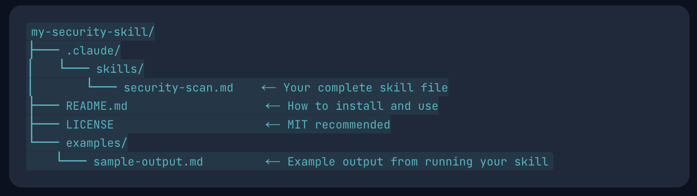

# AI Security Auditor

  

AI Security Auditor is a Claude skill for reviewing Solidity and Foundry projects for common smart-contract vulnerabilities. It performs a structured security pass over the codebase, reports prioritized findings, and explains the evidence behind each issue so results can be reviewed instead of blindly trusted.

## Install

Clone this repository:

```bash
git clone https://github.com/ZealynxSecurity/ai-security-auditor.git
cd ai-security-auditor
```

Copy the skill into the project you want to audit:

```bash
cp -R .claude/skills/ /path/to/your-project/.claude/
```

If your project already has `.claude/skills/`, copy the individual security-auditor skill folder into that directory instead of replacing your existing skills.

## Run

From the root of the Solidity or Foundry project you want to audit, run:

```text
/security-scan
```

The skill will inspect the project sources and produce a security report with severity, affected file/function, evidence, impact, and suggested remediation.

## What It Detects

The auditor is designed to look for vulnerability classes commonly found in smart-contract reviews, including:

- Access-control mistakes, such as unprotected initialization or privileged functions
- Reentrancy risks around external calls and state updates
- Oracle integration issues, including stale, invalid, or unchecked prices
- Precision loss and unsafe arithmetic ordering, such as division before multiplication
- Slippage and deadline omissions in swap or value-transfer flows
- Unsafe external calls and unchecked return values
- Missing input validation and dangerous trust assumptions
- Upgradeability and initialization hazards

The included `ai-auditor-test-project` benchmark contains five planted findings across access control, reentrancy, oracle validation, precision loss, and slippage protection.

## Architecture

This skill uses a multi-phase single-agent review flow rather than a purely one-shot prompt. The goal is to keep the workflow lightweight while still forcing the model to separate discovery, analysis, and verification.

1. **Project mapping:** Identify Solidity files, dependency layout, compiler version, entry points, and high-risk surfaces such as external/public functions, value transfers, privileged flows, oracle reads, and swap logic.
2. **Category-driven detection:** Review code against a focused checklist of vulnerability classes, looking for concrete source evidence instead of generic warnings.
3. **Exploitability analysis:** For each candidate issue, reason through attacker capabilities, reachable call paths, asset impact, and any mitigating code.
4. **Verification pass:** Re-check each finding against the source before reporting it, remove duplicates, downgrade weak claims, and mark uncertain items clearly.
5. **Report generation:** Output concise findings with severity, location, impact, evidence, and remediation guidance.

The detection strategy combines pattern recognition with semantic review. It does not only search for keywords like `transfer` or `onlyOwner`; it checks whether surrounding state changes, authorization boundaries, price assumptions, arithmetic order, and user-provided parameters make the pattern exploitable.

Verification is evidence-first: every reported issue should point to specific code and explain why existing guards are insufficient. Findings that cannot be tied to a concrete source location should be excluded or labeled as informational.
